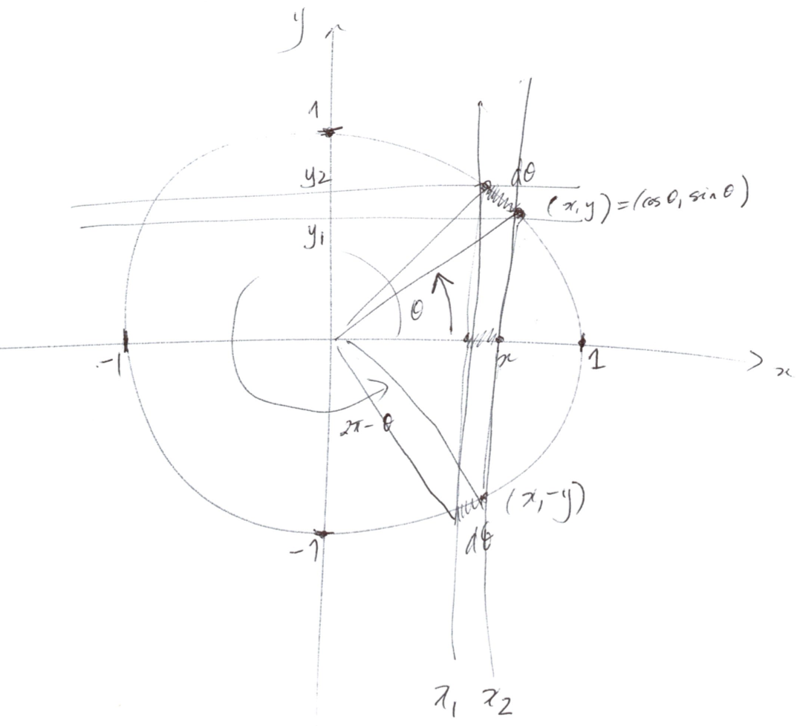

```{r setup, include=FALSE}
knitr::opts_chunk$set(echo = TRUE, fig.align = "center")
```

# Introduction

This document investigates some probability distributions associated with 
$n$-dimensional spheres.
I am interested in these probability distributions because they arise 
as velocity distributions in
statistical mechanics and are relevant to the concept of entropy.

The unit sphere is a compact submanifold of Euclidean space.
Euclidean space has a rotationally invariant metric which lets us define
lengths, areas, volumes, and higher-dimensional measures on its submanifolds.
The restriction of the metric to the unit sphere in Euclidean space induces a
uniform probability distribution on the sphere.
I am going to consider certain random variables on these spheres and 
derive analytical expressions for their probability distributions.
If we regard the Euclidean space as a velocity phase space of $N$ point particles
then the random variables of interest are the components of velocity of some particle
and the sum of their sums, which corresponds to the particle's kinetic energy

My goal is to prove the following hypothesis:

*The probability distribution for the velocity of the particles of an ideal gas is that
distribution which maximizes entropy.*

This probability distribution $f(v)$ is known as the 
[Maxwell-Boltzman distribution](https://en.wikipedia.org/wiki/Maxwell–Boltzmann_distribution) 
and is equal to:
$$
f(v) = \sqrt{\left(\frac{m}{2\pi k T}\right)^3}4\pi v^2 e^{-\frac{mv^2}{2kT}}
$$
where $m$ is the particle mass, $k$ is Boltzman's constant, 
and $T$ is the thermodynamic temperature.
The 
[Feynman Lectures on Physics](https://en.wikipedia.org/wiki/The_Feynman_Lectures_on_Physics)
contain a derivation of the Maxwell-Boltzman distribution using physical arguments.
Wouldn't it be cool if this distribution popped out automatically from the 
[Second Law of Thermodynamics](https://en.wikipedia.org/wiki/Second_law_of_thermodynamics)!

## The Role of the Monte Carlo Method

Since it is easy to make mathematical errors,
I will also use the 
[Monte Carlo method](https://en.wikipedia.org/wiki/Monte_Carlo_method) 
as an independent sanity check on 
the correctness of the derived analytical expressions for these 
probability distributions.

Let `num.samples` denote the number of samples to be used in each Monte Carlo run.

```{r}
num.samples <- 1000000
```

# The 1-dimensional Sphere $S^1$

The 1-dimensional sphere $S^1$ is the circle of radius one in $\mathbb{R}^2$.
$$
S^1 = \{ (x,y) : \mathbb{R}^2\ |\ x^2 + y^2 = 1 \}
$$
## Polar Coordinates on $S^1$

Any point in $(x,y) \in S^1$ defines a unique angle $\theta$ such that 
$0 \leq \theta < 2\pi$ by: 
$$
x = \cos \theta \\ 
y = \sin \theta
$$
This relation defines an isomorphism:$$
\Theta : S^1 \rightarrow [0,2\pi)
$$
$\Theta$ is a smooth function everywhere on $S^1$ except at the point $(1,0)$ where it
jumps by $2\pi$ as we cross the $x$-axis in the clockwise direction.

```{r,engine='tikz',fig.ext='pdf',fig.align='center', echo=FALSE, fig.cap="The unit circle $S^1$ in $\\mathbb{R}^2$"}
\begin{tikzpicture}[scale=3]

\draw[step=1cm,help lines] (-1.4,-1.4) grid (1.4,1.4);

% draw the x-y axes
\draw[->] (-1.5,0) -- (1.5,0) node[anchor=west] {$x$};
\draw[->] (0,-1.5) -- (0,1.5) node[anchor=south] {$y$};
\draw (1,0) node[anchor=north west] {$1$};
\draw (-1,0) node[anchor=north east] {$-1$};
\draw (0,1) node[anchor=south east] {$1$};
\draw (0,-1) node[anchor=north east] {$-1$};

% draw the unit circle
\draw (0,0) circle (1);

% coordinates of point A
\newcommand{\thetaA}{30}
\pgfmathsetmacro{\xA}{cos(\thetaA)}
\pgfmathsetmacro{\yA}{sin(\thetaA)}

% coordinates of point B - not used!
\newcommand{\thetaB}{35}
\pgfmathsetmacro{\xB}{cos(\thetaB)}
\pgfmathsetmacro{\yB}{sin(\thetaB)}

% draw point A
\fill (\xA,\yA) circle (0.3mm) node[anchor=west] {$(\cos\theta,\sin\theta)$};

% draw the arc to A
\draw (0,0) -- (\xA, \yA);
\draw[->] (0.4,0) arc (0:\thetaA:0.4);
\draw (20:0.2) node[anchor=west] {$\theta$};

\end{tikzpicture}
```

The length $ds$ of the infinitesimal line segment $AB$ in $\mathbb{R}^2$ from
the point $A = (x,y)$ to $B = (x+dx,y+dy)$ is given by:
$$
ds = \sqrt{(dx)^2 + (dy)^2}
$$
The displacement $(dx,dy)$ along a small arc segment of $S^1$ is given by:
$$
\begin{aligned}
dx &= -\sin\theta d\theta \\
dy &= \cos\theta d\theta
\end{aligned}
$$
The arc length $ds$ on $S^1$ is therefore:
$$
\begin{aligned}
ds 
&= \sqrt{\sin^2\theta + \cos^2\theta}d\theta \\
&= d\theta
\end{aligned}
$$
The mapping $\Theta$ preserves distance and is therefore an isometry
from $S^1$ to $[0,2\pi)$.
This means that $S^1$ is locally flat when viewed as a metric space and that $\Theta$
flattens it onto a line segment.
This local flatness is a special property of $S^1$.
Spheres of higher dimension have instrinsic curvature.

## The Uniform Distribution on $S^1$ in Polar Coordinates

Consider the uniform probability distribution on $S^1$.
Using $\Theta$ this uniform distribution on $S^1$ becomes a uniform distribution on
$[0,2\pi]$.
Its probability density function $\rho(\theta)$ is: 
$$
\rho(\theta) = \frac{1}{2\pi}
$$
$\rho$ is correctly normalized to unity as is required for a probability density function:
$$
\begin{aligned}
\int_0^{2\pi}\rho(\theta)d\theta 
&= \int_0^{2\pi}\frac{1}{2\pi}d\theta \\
&= 1
\end{aligned}
$$
```{r def.rho}
rho <- function(theta) {
  rep(1/(2*pi), times=length(theta))
}
```

Now I'll check the correctness of the expression for $\rho(\theta)$
by generating a uniform random sample `theta.sample` on the interval $[0,2\pi]$

```{r}
2*pi
theta.sample <- runif(num.samples,0,2*pi)
head(theta.sample)
```

The following chart is a histogram of `theta.sample`.
The derived uniform probability density function $\rho$ is overlaid as a blue curve.

```{r}
num.bins <- 30
theta.breaks <- seq(0, 2*pi, length.out = num.bins + 1)
hist(theta.sample, probability = TRUE, breaks = theta.breaks, col="grey", border="white")

rho.theta <- rho(theta.breaks)
lines(x=theta.breaks,y=rho.theta,col="blue",lwd=2)
```
Note that $\frac{1}{2\pi} \approx `r 1/(2*pi)`$ which agrees with the height of
the histogram.
```{r one-over-two-pi}
1/(2*pi)
```

Now treat the $x$ coordinate of $\theta \in [0,2\pi]$ as a random variable.
The mapping is $x = \cos \theta$.
$$
\begin{aligned}
\frac{dx}{d\theta} 
&= -\sin\theta \\
&= -y \\
&= -\sqrt{1-x^2}
\end{aligned}
$$
The following diagram illustrates the geometry of the projection of $S^1$ to the $x$-axis.


Two values of $\theta$  map to each $x$ since
$$
\cos\theta = \cos(2\pi-\theta)
$$
The induced probability density function $\rho_1$ on $[-1,1]$is therefore:
$$
\begin{aligned}
\rho_1(x)dx 
&= 2|\rho(\theta)|d\theta \\
&= \frac{1}{\pi}d\theta \\
&= \frac{dx}{\pi\sqrt{1-x^2}}
\end{aligned}
$$
```{r def.rho.1}
rho.1 <- function(theta) {
  1/(pi*sqrt(1-cos(theta)^2))
}
```
The following chart is a histogram of the random variable $x = \cos\theta$.
The derived probability density function $\rho_1(x)$ is overlaid as a blue curve.
```{r}
x.sample <- cos(theta.sample)
x.breaks <- seq(-1, 1, length.out = num.bins + 1)
hist(x.sample, probability = TRUE, breaks = x.breaks, col = "grey", border="white")

rho.x <- 1/(pi*sqrt(1-x.breaks^2))
lines(x=x.breaks,y=rho.x,col="blue",lwd=2)
```

## The Uniform Distribution on $S^1$ as a Submanifold of $\mathbb{R}^2$

Let $\rho_n : S^n \rightarrow \mathbb{R}$ be the probability density function of the
uniform distribution on $S^n$.
I am going to generate random samples from $\rho_n$ in the following sections.
Unfortunately, the simple approach I used above for $S^1$ does not generalize to $n>1$.

The case for $S^1$ was simple because the coordinate function $\Theta$ mapped
$S^1$ isometrically to the interval $[0,2\pi)$ and I could therefore 
call the built-in R uniform distribution function `runif` to generate random samples.

The general way to generate uniform random samples on $S^n$ is as follows.
Regard $S^n$ as the set of unit vectors in $\mathbb{R}^{n+1}$.
Any non-zero vector $v \in \mathbb{R}^{n+1}$ defines a unit vector $u$ by:
$$
u = \frac{v}{\|v\|}
$$

Let $B^n \subset \mathbb{R}$ be the solid unit ball:
$$
B^n = \{ v : \mathbb{R}^n \ | \ \|v\| \leq 1 \}
$$
The boundary of the ball is the sphere:
$$
\partial B^n = S^{n-1}
$$

Let $C^n \subset \mathbb{R}$ be the solid cube:
$$
C^n = [-1,1]^n
$$

The ball is a subset of the cube:
$$
B^n \subseteq C^n
$$

The following algorithm uses this approach to generate a random sample of uniformly distributed unit 
vectors:

1. Generate a random vector $v$ in the cube $C^{n+1}$ by calling `runif` on the interval $[-1,1]$ for each component of $v$.
2. If $v = 0$ or $v \notin B^{n+1}$ then discard $v$ and return to Step 1.
3. Normalize $v$ to produce a unit vector $u \in S^n$.
4. Add $u$ to the sample.
5. Repeat Steps 1 through 4 until the desired number of unit vectors have been generated.

The R function `rsphere.slow` implements this algorithm.

```{r def.rsphere.slow}
rsphere.slow <- function(num.samples, n) {
  u.sample <- matrix(nrow = num.samples, ncol = n+1)
  for(i in 1:num.samples) {
    repeat {
      v <- runif(n+1,-1,1)
      norm.squared <- sum(v*v)
      if (norm.squared > 0 & norm.squared <= 1) break
    }
    u.sample[i,] <- v/sqrt(norm.squared)
  }
  u.sample
}
```

I named the preceding function `rsphere.slow` because it fails to take advantage of R's 
vector processing capabilities.
I can speed up the implementation by processing multiple vectors in each R function call.

```{r def.rsphere.faster}
rsphere.faster <- function(num.samples, n) {
  u.sample <- matrix(0,nrow = 0, ncol = n+1)
  while(dim(u.sample)[1] < num.samples) {
    m <- num.samples - dim(u.sample)[1]
    v <- matrix(runif(m*(n+1),-1,1), nrow = m)
    norm.squared <- rowSums(v*v)
    keep <- norm.squared > 0 & norm.squared <= 1
    u.sample <- rbind(u.sample, v[keep,] / sqrt(norm.squared[keep]))
  }
  u.sample
}
```

Although `rsphere.faster` is an improvement, it becomes very inefficient as the sphere dimension
$n$ increases.
The reason is that we are generating random vectors in the cube
but are only keeping those that lie in the ball.
As $n$ increases, the ball occupies a decreasing fraction of the cube.
The following table compares the volumes of cubes and balls for several
dimensions where $S_r^n$, $B_r^n$, and $C_r^n$ denote the sphere, ball, and cube of radius $r > 0$.

$n$   | $S_r^{n-1}$ | $B_r^n$               | $C_r^n$ | $B_r^n/C_r^n$
----  | ----        | ----                  | ----    | ----
$1$   | $2$         | $2r$                  | $2r$    | $1$
$2$   | $2\pi r$    | $\pi r^2$             | $4r^2$  | $\frac{1}{4}\pi = `r pi/4`$
$3$   | $4\pi r^2$  | $\frac{4}{3}\pi r^3$  | $8r^3$  | $\frac{1}{6}\pi = `r pi/6`$
$4$   | $2\pi^2r^3$ | $\frac{1}{2}\pi^2r^4$ | $16r^4$ | $\frac{1}{32}\pi^2 = `r pi^2/32`$ 

As $n$ becomes large, the ratio of the volume of the unit ball to the volume of the cube approaches $0$.
Therefore, for very large $n$, if we randomly select a vector from the uniform distribution on the cube
then the probability that it lies in the ball approaches $0$.

The way around this problem is to use the normal distribution in $\mathbb{R}$ instead of the
uniform distribution on $[-1,1]$.
If the components of the vector are identically and independently generated from a normal distribution
then the resulting distribution of the vectors is spherically symmetric.
The R function `rsphere` uses this approach
Now we only need to discard vectors of length $0$, but the probability of generating one of those
is $0$.
Therefore, virtually every randomly generated vector defines a unit vector for the sample.

```{r def.rsphere}
rsphere <- function(num.samples, n) {
  u.sample <- matrix(0,nrow = 0, ncol = n+1)
  while(dim(u.sample)[1] < num.samples) {
    m <- num.samples - dim(u.sample)[1]
    v <- matrix(rnorm(m*(n+1)), nrow = m)
    norm.squared <- rowSums(v*v)
    keep <- norm.squared > 0
    u.sample <- rbind(u.sample, v[keep,] / sqrt(norm.squared[keep]))
  }
  u.sample
}
```

I'll use `rsphere` to generate a sample for $S^1$ and compare it to the expected
distribution $\rho_1$.

```{r}
u.sample <- rsphere(num.samples, 1)
hist(u.sample[,1], probability = TRUE, breaks = x.breaks, col = "grey", border="white")
lines(x=x.breaks,y=rho.x,col="blue",lwd=2)
```

# The 2-dimensional Sphere $S^2$

Now let's repeat this for $S^2$.
```{r}
u.sample <- rsphere(num.samples, 2)
hist(u.sample[,1], probability = TRUE, breaks = x.breaks, col = "grey", border="white")
```


